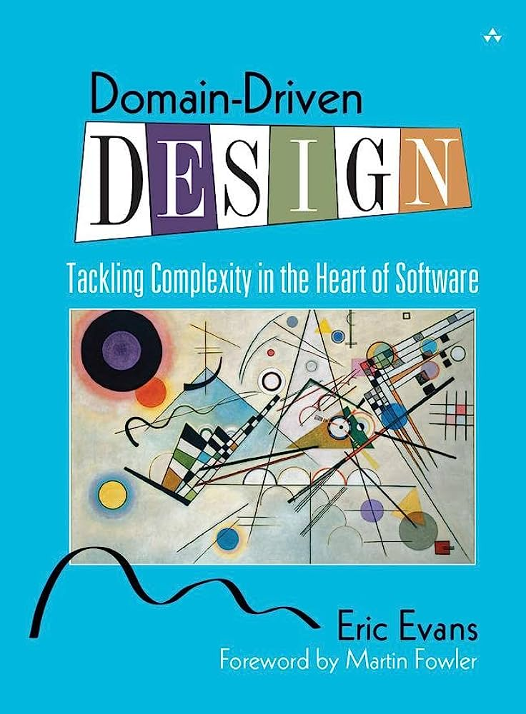
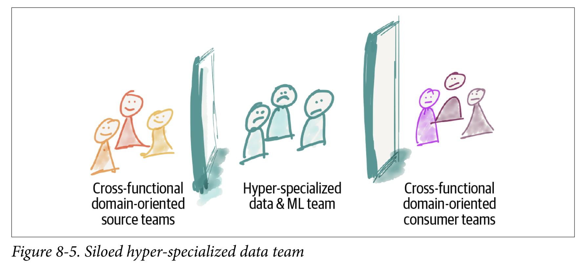

# Domain-Driven Design in Simple Words

The book: [Domain-Driven Design: Tackling Complexity in the Heart of Software](https://www.amazon.com/Domain-Driven-Design-Tackling-Complexity-Software/dp/0321125215)

## What is Domain-Driven Design?

It's a strategy to build a software from domain models.

## What is a Domain?

A domain is an area of knowledge.

    
Examples

- Geography
- Mechanics (Physics)
- Food delivery

## What is a Model?

A model is simplified version of knowledge, with a specific purpose, and written in a ubiquitous language.

    
Examples

- World maps: simplified knowledge in geography
    - [Mercator projection](https://en.wikipedia.org/wiki/Mercator_projection#/media/File:Mercator_projection_Square.JPG): its purpose is to preserve the relative **positions** between continents
    - [AuthaGraph projection](https://en.wikipedia.org/wiki/AuthaGraph_projection#/media/File:Projection_AuthaGraph.png): its purpose is to preserve the relative **size** of continents
- Laws of physics: simplified knowledge in mechanics
    - [Newton's laws of motion](https://en.wikipedia.org/wiki/Newton%27s_laws_of_motion): its purpose is to describe how things work in **classical mechanics**
    - [Schrödinger equation](https://en.wikipedia.org/wiki/Schr%C3%B6dinger_equation): its purpose is to describe how things work in **quantum mechanics**
- Class diagram of food delivery companies
    - [FTGO class diagram](./ftgo-class-diagram.png): its purpose is to keep the company running (FTGO is a imaginary company from the book [Microservices Patterns](https://www.amazon.com/Microservices-Patterns-examples-Chris-Richardson/dp/1617294543))

## What is a Ubiquitous Language?

A ubiquitous language is a set of terms. One term can have only one meaning, and one meaning can only be expressed by one term.

    
Comics

## It's too difficult to create a single domain model for our software!

We can divide our domain into subdomains. Each subdomain are within a bounded context.

    
Types

- Core subdomain: the most valuable subdomain of the domain
- Support subdomains: the subdomains to support the core subdomain
- Generic subdomains: like support subdomains, but generic enough to use 3rd-party solutions

## What is a Bounded Context?

A bounded context defines a boundary for a subdomain. The boundary should be physical, e.g. organization, code.

    
Details

Relationships between 2 bounded contexts:

- Shared kernel: 2 uncoordinated teams share some subset of the domains
- Customer/supplier development teams: 2 teams work as upstream and downstream teams, and upstream team will help downstream team
- Conformist: 2 teams work as upstream and downstream, but upstream doesn't help downstream team, so downstream can only follow what downstream provides
- Anticorruption layer: new team design a new interface for legacy systems
- Separate ways: don't integrate at all
- Open host service: stronger version of anticorruption layer
- Published language: stronger version of open host service

## How to define good subdomains and bounded contexts?

A good subdomain/bounded context should have high cohesion and low coupling, so that it can work on its own and doesn't rely on too much communication with others.

    
Bad examples

The 3 teams in the following picture have low cohesion, so they cannot work on their own separately. They also have high coupling, so they have to communicate with between teams very often.

Picture is from the book [Data Mesh](https://www.amazon.com/Data-Mesh-Delivering-Data-Driven-Value/dp/1492092398).

